---
author:
- Jonathan Amme
- Guido Pleßmann
title: WindNODE ABW
subtitle: A regional energy system model for Anhalt-Bitterfeld-Wittenberg
institute: Reiner Lemoine Institut
classoption: aspectratio=169
date: \today
theme: rli
urlcolor: rlilinkcolor
output:
  pdf_document:
    md_extensions: +grid_tables
header-includes:
- |
  \newcommand{\tel}{+49 (0)30 1208 434 26}
  \newcommand{\email}{jonathan.amme@rl-institut.de}
  \newcommand{\event}{oemof user meeting, spring 2020}
  \newcommand{\twitter}{\href{https://twitter.com/RL_Institut}{@RL\_Institut}}
  \newcommand{\finalstatement}{Questions?}
  \tikzset{
  invisible/.style={opacity=0},
  visible on/.style={alt={#1{}{invisible}}},
  alt/.code args={<#1>#2#3}{%
    \alt<#1>{\pgfkeysalso{#2}}{\pgfkeysalso{#3}} % \pgfkeysalso doesn't change the path
  },
  }
  \usetikzlibrary{shapes,arrows}
  \usepackage{blindtext}
nocite: '@*'
---

# WindNODE

- Duration: 2016 - 2020
- Regions: Anhalt-Bitterfeld-Wittenberg and Uckermark
- Objective: Investigation of 2 different regional approaches to integrate high
  shares of renewable energy
- Focus in ABW: Use of flexibility options in order to avoid curtailment, use
  surpluses from renewable energy and increase their local share

\begin{figure}
\begin{minipage}{0.45\textwidth}
\centering
\includegraphics[height=2 cm]{img/Windnode-R.jpeg}%
\end{minipage}%
\begin{minipage}{0.45\textwidth}
\centering
\includegraphics[height=3 cm]{img/Koppellogo_DEU_2300x730_WEB.png}%
\end{minipage}%
\end{figure}

# Study Region

\vspace{-6.5ex}
\center
{ height=51% }

# Study Region

\vspace{-6ex}
\center
{ height=52% }

# Motivation and Scope

Goals

- Regional and superordinate objectives to increase RE share and reduce
  greenhouse gas emissions
- Increase local self-sufficiency

Research questions

- To what extent can those objectives be achieved within the region?
  (e.g. national climate protection goals)
- What land requirements result from these goals? ($\rightarrow$ limited
  availability)
- To what degree can DSM, PtH and batteries be used to increase flexibility?
- How does the grid load change due to more RE and evolving flexibilities?
- What's the influence of self-sufficiency (targets)? 

# Energy System: (National) power grid

\vspace{-6ex}
\center
{ height=52% }

# Energy System: Components

\vspace{-6ex}
\center
{ height=52% }

# Energy System: Components

\vspace{-6ex}
\center
{ height=52% }

# Energy System: Components

\vspace{-6ex}
\center
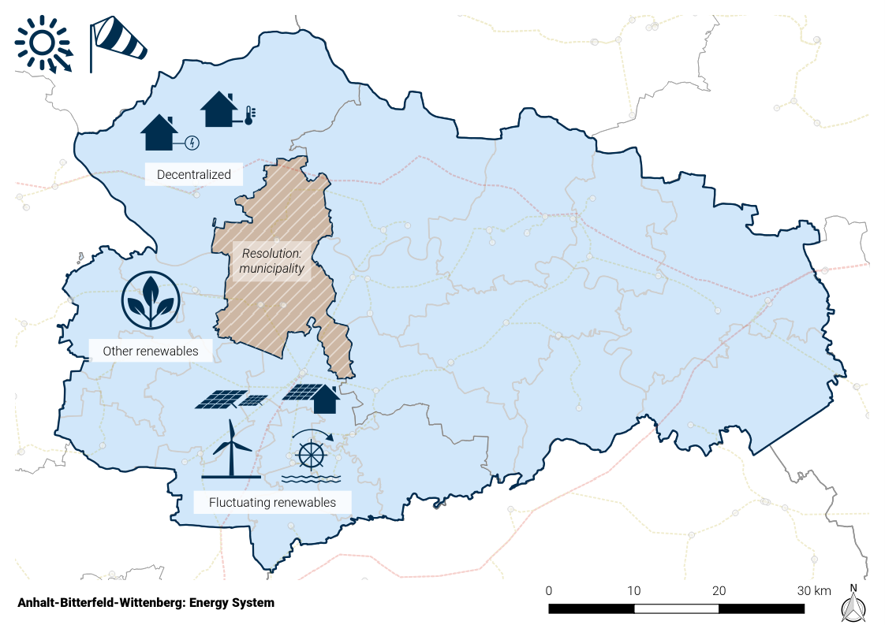{ height=52% }

# Energy System: Components

\vspace{-6ex}
\center
{ height=52% }

# Energy System: Components

\vspace{-6ex}
\center
{ height=52% }

# Energy System: Components

\vspace{-6ex}
\center
{ height=52% }

# Energy System Model: Overview

- 1 year
- Temporal resolution: 1h
- Spatial resolution: municipality resp. HV/MV substation 
- ~1k nodes
- Dispatch optimization only (costs)

\vspace{-1ex}
{ height=30% }

# ESM: Municipality (1/11)

\vspace{-6ex}
\center
{ height=52% }

# ESM: Municipality (2/11) - El. Buses

\vspace{-6ex}
\center
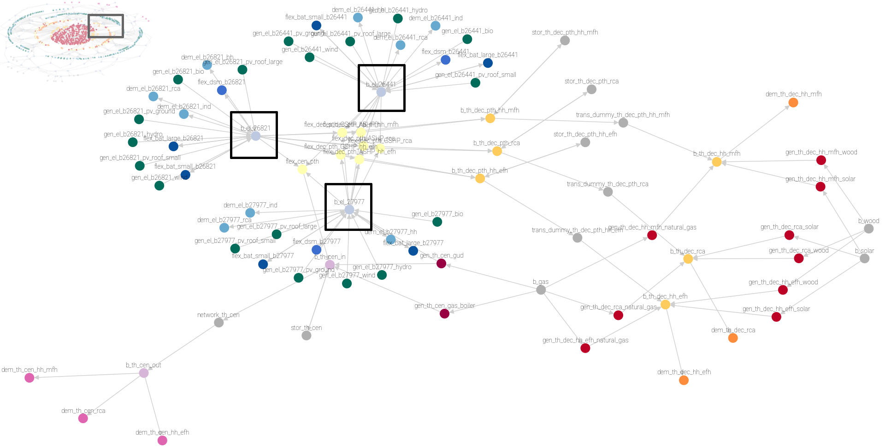{ height=52% }

# ESM: Municipality (3/11) - Commodity Buses

\vspace{-6ex}
\center
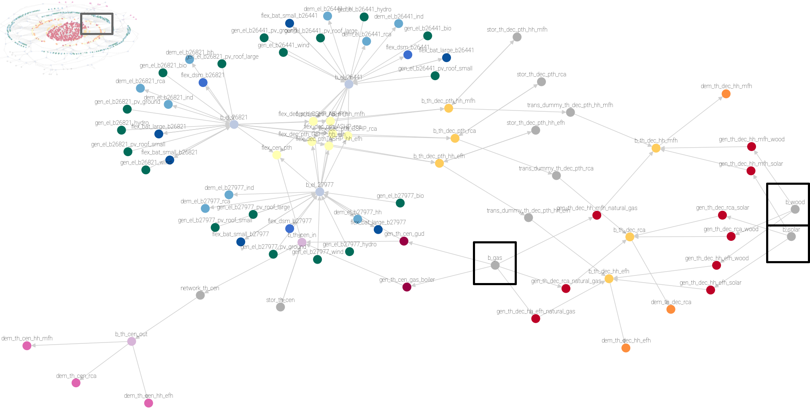{ height=52% }

# ESM: Municipality (4/11) - El. Demand

\vspace{-6ex}
\center
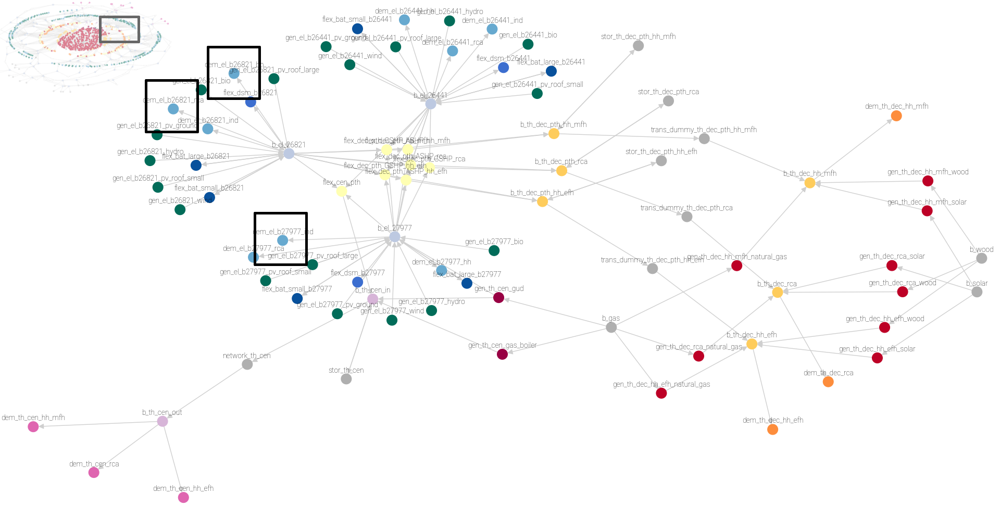{ height=52% }

# ESM: Municipality (5/11) - El. Generators (fixed)

\vspace{-6ex}
\center
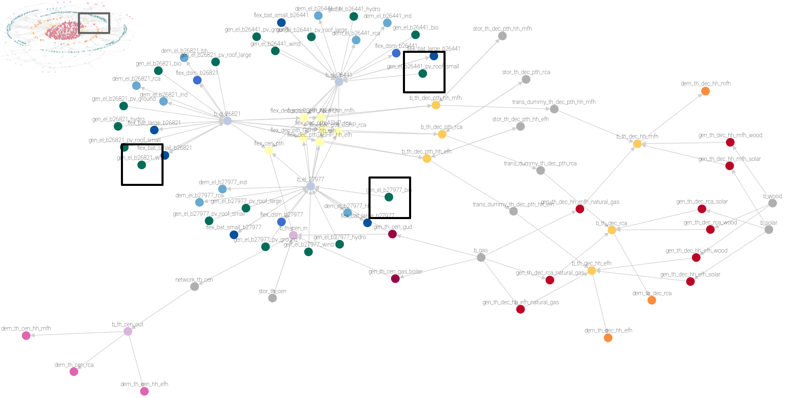{ height=52% }

# ESM: Municipality (6/11) - Th. Demand (decentral)

\vspace{-6ex}
\center
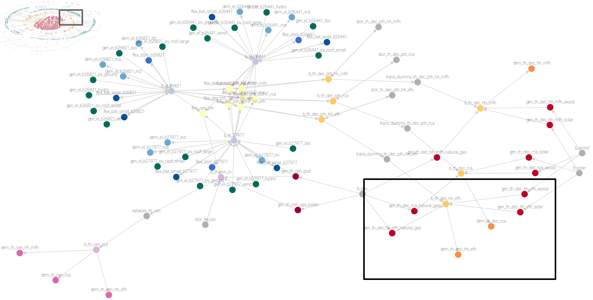{ height=52% }

# ESM: Municipality (7/11) - Heat pumps (decentral PtH)

\vspace{-6ex}
\center
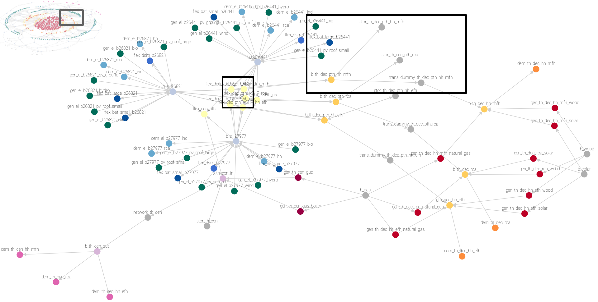{ height=52% }

# ESM: Municipality (8/11) - Th. Dem. + Gen. (central)

\vspace{-6ex}
\center
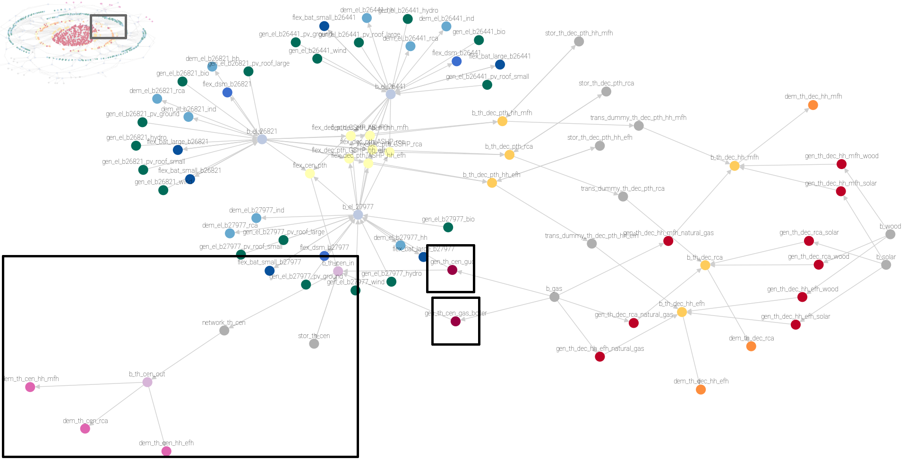{ height=52% }

# ESM: Municipality (9/11) - Boilers (central PtH)

\vspace{-6ex}
\center
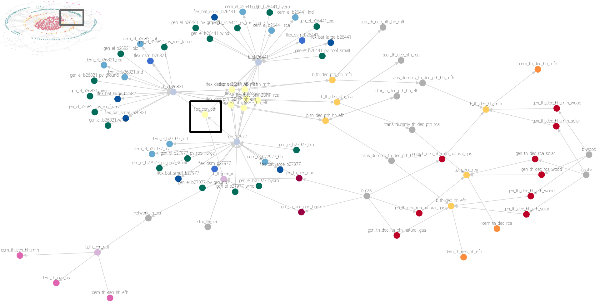{ height=52% }

# ESM: Municipality (10/11) - Battery Storages

\vspace{-6ex}
\center
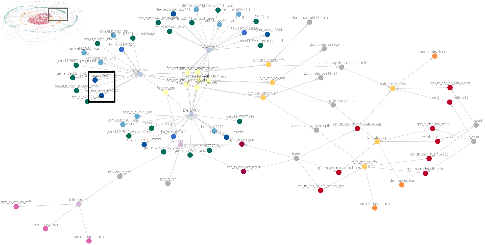{ height=52% }

# ESM: Municipality (11/11) - DSM

\vspace{-6ex}
\center
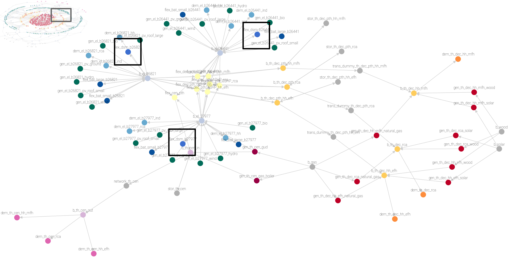{ height=52% }

# Data

- Wind feedin: windpowerlib via reegis (weather: coastdat2)
- PV feedin: renewables.ninja (weather: CM-SAF SARAH)
- Power units: OPSD, MaStR, plant operators
- Power demand (HH, RCA, Ind.) : open_eGo, demandlib
- Heat demand (HH): DESTATIS, DemandRegio, IWU, demandlib
- Heat demand (retail, comm., agricultural): STALA, Federal Employment Agency, BMWi, demandlib
- Power Grid: open_eGo
- Land availability: Regional Planning Authority, Environmental Protection Agency of Sachsen-Anhalt

PostgreSQL DB + SQLAlchemy

# Scenarios

- Status quo

- Future scenarios based upon 
    - NEP: Szenariorahmen 2021
    - ISE: Wege zu einem klimaneutralen Energiesystem

- Dimensions
    - Time: 2017, 2035, 2050
    - Land availability -- RE-Share (esp. Wind, PV)
    - Energy consumption / efficiency
    - Flexibility options (DSM, PtH, Storages)
    - Self-sufficiency

# Land Availability: Wind (1/5) - Restriction areas

Determine available area using GIS, method:

\vspace{5ex}
\begin{tikzpicture}[node distance = 2.5cm, auto]
    \tikzstyle{block} = [rectangle, draw, fill=blue!20, text width=5em, text centered,
                         rounded corners, minimum height=4em]
    \tikzstyle{cloud} = [draw, ellipse, node distance=3cm, minimum height=2em]
    \tikzstyle{line} = [draw, -latex']

    \node [cloud] (area0) {Region's area};
    \node [block, right of=area0, node distance=3cm] (strict_restr) {Strict restrictions};
    \node [block, right of=strict_restr] (weak_restr) {Weak restrictions};
    \node [block, right of=weak_restr] (case) {Case-by-case decisions};
    \node [cloud, right of=case] (area1) {Available area};
    
    \path [line] (area0) -- node {\scriptsize 100\%}(strict_restr);
    \path [line] (strict_restr) -- node {\scriptsize 51\%} (weak_restr);
    \path [line] (weak_restr) --  node {\scriptsize 10\%} (case);
    \path [line] (case) -- node {\scriptsize 1\%} (area1);
\end{tikzpicture}

# Land Availability: Wind (2/5) - Restriction areas

\vspace{-6ex}
\center
{ height=52% }

# Land Availability: Wind (3/5) - ~10 % left

\vspace{-6ex}
\center
{ height=52% }

# Land Availability: Wind (4/5) - Result: 1 %

\vspace{-6ex}
\center
{ height=52% }

# Land Availability: Wind (5/5) - Potential Areas

\vspace{-6ex}
\center
{ height=52% }

# RE Potential: Wind in Numbers

| Distance to settlements [m] | Use forests? | Area [ha] | Inst. WEC Count* | **Inst. WEC power [MW]*** |
|------------------------:|--------------|----------:|-----------------:|----------------------:|
|                     500 | no           |     87847 |              439 |              **1844** |
|                    1000 | no           |     30713 |              154 |               **752** |
|                    1500 | no           |      7461 |               37 |               **155** |
|                     500 | yes          |    147652 |              738 |              **3100** |
|                    1000 | yes          |     69057 |              345 |              **1449** |
|                    1500 | yes          |     25629 |              128 |               **538** |

*10 % of total potential area available (due to case-by-case decisions),
WEC: Enercon E-141 4.2 MW, 20 ha/MW 

# Land Availability: Ground-mounted PV (1/2)

Determine available area using GIS, method:

\vspace{5ex}
\begin{tikzpicture}[node distance = 2.5cm, auto]
    \tikzstyle{block} = [rectangle, draw, fill=blue!20, text width=5em, text centered,
                         rounded corners, minimum height=4em]
    \tikzstyle{cloud} = [draw, ellipse, node distance=3cm, minimum height=2em]
    \tikzstyle{line} = [draw, -latex']

    \node [cloud] (area0) {Region's area};
    \node [block, right of=area0] (support) {Filter by current support scheme};
    \node [block, right of=support, node distance=3cm] (strict_restr) {Strict restrictions};
    \node [block, right of=strict_restr] (weak_restr) {Weak restrictions};
    \node [cloud, right of=weak_restr] (area1) {Available area};
    
    \path [line] (area0) -- (support);
    \path [line] (support) -- (strict_restr);
    \path [line] (strict_restr) -- (weak_restr);
    \path [line] (weak_restr) -- node {\scriptsize 1\%} (area1);
\end{tikzpicture}

# Land Availability: Ground-mounted PV (2/2)

\vspace{-6ex}
\center
{ height=52% }

# RE Potential: Ground-mounted PV in Numbers

|                                          | Strict: area [ha] | **Strict: el. power [MWp]*** | Strict+weak: area [ha] | **Strict+weak: el. power [MWp]*** |
| ---------------------------------------- | -----------:| -----------------------------:| -----------:| -----------------------------:|
| Federal motorways                        |       226,0 |                         150,7 |       138,0 |                          92,0 |
| Railways                                 |      1959,0 |                        1306,0 |       963,0 |                         642,0 |
| Fields and meadows with low soil quality |     45352,6 |                       30234,7 |     13997,0 |                        9331,3 |
| - max. 1 % availability                  |    *2086,0* |                        1390,7 |    *2086,0* |                        1390,7 |
| **Sum**                                  |  **4271,0** |                    **2847,4** |  **3187,0** |                    **2124,7** |

*max. 1 % of total(!) fields and meadows available, 1.5 ha/MWp

# FRE Targets vs. Land Availability

\vspace{-6ex}
\center
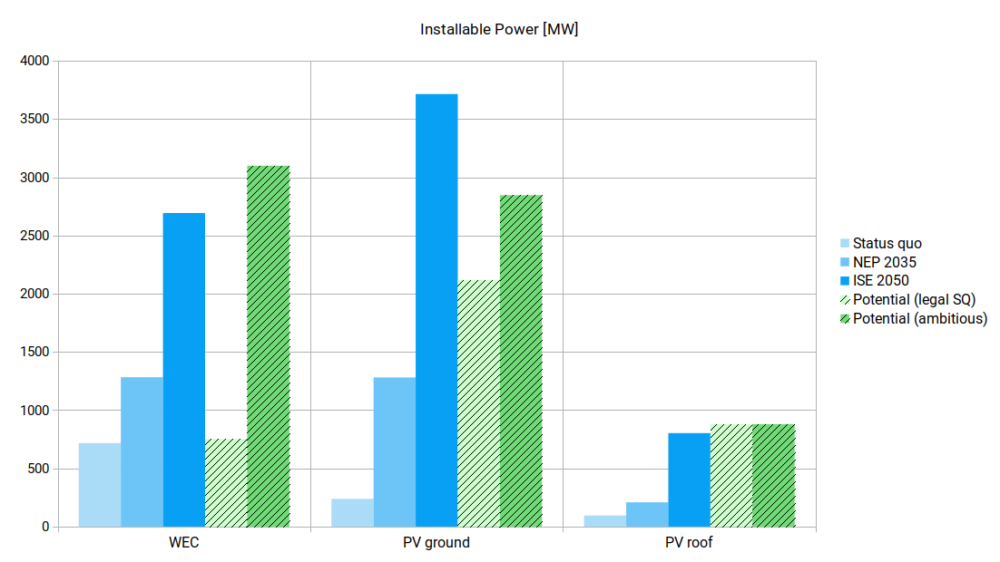{ height=45% }

# Land Availability: Background

\centering

**Stakeholder Empowerment (StEmp) Tool ABW** (under the hood: _oemof_)

\vspace{1.25ex}
\centering
{ height=20% }

\vspace{1.25ex}
**Tool:** [https://wam.rl-institut.de/stemp_abw/](https://wam.rl-institut.de/stemp_abw/)

\vspace{1.25ex}
**Docs:** [https://stemp-abw.readthedocs.io](https://stemp-abw.readthedocs.io)

\vspace{1.25ex}
**Source:** [https://github.com/rl-institut/WAM_APP_stemp_abw/](https://github.com/rl-institut/WAM_APP_stemp_abw/)

# Current Status and Open Tasks

Done

- Create model
- Create Scenarios

TBD

- Detailed analysis
- Docs on RTD
- Model description on oemof website

# {.plain}

\insertendpagecontent

# References

\scriptsize
\setlength{\parindent}{-0.2in}
\setlength{\leftskip}{0.2in}
\setlength{\parskip}{8pt}
